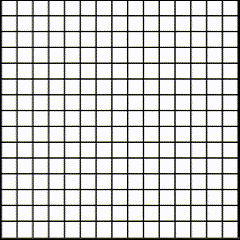
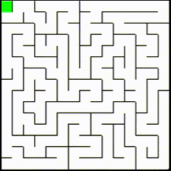
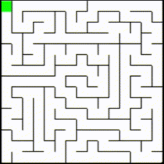

# project_visulization

This C++ mini-project of mine **randomly generates mazes**, **solves them using multiple algorithms**, and **visualizes the entire process in real time**.
---
This project is primarily built to implement and understand how different graph and maze-solving algorithms work in practice.It offers both algorithmic insights and real-time visual feedback, making it a great educational tool for learning pathfinding strategies.
---
## Maze Creation

The maze is generated using Randomized Depth-First Search algorithm, which starts at a random cell and recursively explores all unvisited neighbors, marking them as visited and adding them to a stack. When no unvisited neighbours are found, the algorithm returns to the last cell with unvisited neighbours and continues exploring until all cells have been visited. 
Unfortunately, due to the recursive nature of Randomized DFS, mazes larger than 95x95 can cause stack overflow.

---
## Maze Solving Algorithms

### Wall Follower (Right-Hand Algo.)

The Wall Follower algorithm follows the left or right wall of the maze until it reaches the exit. It always keeps the wall on its right (or left) side. This algorithm guarantees that it will find the exit if it exists and the maze is simply connected.

### A* Algorithm

The A* Algorithm is a pathfinding algorithm that finds the shortest path between two points in a graph. In this program, the maze is represented as a graph, with each cell being a node and its neighboring cells being its edges. The A* Algorithm uses a heuristic function to estimate the distance from the current node to the goal node (in our case: manhattan distance) and chooses the node with the lowest total cost to explore next.

**This project was not only built to understand maze and graph algorithms but also designed with extensibility in mind.**
The core visualization engine can be adapted to simulate and display other popular pathfinding algorithms such as **Dijkstra’s**, **BFS**, and **Greedy Best-First Search**

## Usage
To use this , compile all the header files and main.cpp file using your preferred C++ compiler. The program requires GLFW and OpenGL libraries to be installed , experience and visualize .
